# 第一章：城市化进程与住房挑战

## 章节概述

本章系统分析全球城市化趋势与特点，研究其对住房需求的深远影响，探索住房供需失衡问题的根源及表现，评估交通拥堵与通勤压力对城市生活质量的影响，以及分析城市资源环境承载力的限制与挑战，为移动住房解决方案提供深入的社会经济背景支撑。

  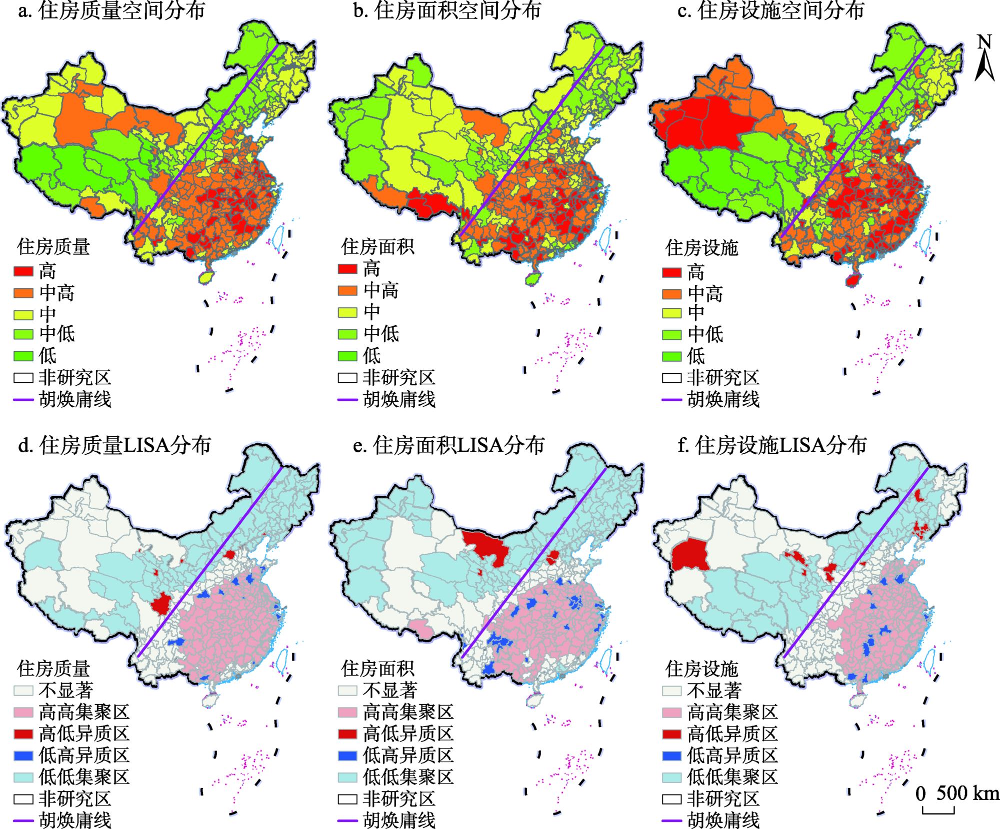
  
<em>图1-1: 城市化进程与住房挑战关系示意图</em>

## 主要内容

### 1. 全球城市化趋势与特点

#### 1.1 全球城市化数据分析

全球城市化呈现加速发展趋势，但区域发展不均衡，产生了一系列新的城市形态与挑战。

**表1-1: 全球主要区域城市化率对比（2023年）**

| 区域 | 城市化率 | 城市人口增长率 | 预计2050年城市化率 |
|------|----------|----------------|-------------------|
| 北美 | 83.8%    | 0.8%/年        | 89.5%             |
| 欧洲 | 81.5%    | 0.3%/年        | 87.2%             |
| 拉丁美洲 | 80.7% | 1.2%/年        | 88.6%             |
| 大洋洲 | 68.3%  | 1.5%/年        | 77.0%             |
| 亚洲 | 51.1%    | 2.3%/年        | 66.2%             |
| 非洲 | 44.5%    | 3.5%/年        | 59.9%             |
| 全球平均 | 56.6% | 1.9%/年       | 68.4%             |

<em>数据来源：UN-Habitat, World Cities Report 2023; United Nations, World Urbanization Prospects 2022</em>

##### 城市化发展关键趋势：

* **特大城市与城市群扩张**：全球拥有1000万以上人口的特大城市从2000年的17个增加到2023年的33个，预计2035年将达到43个。城市群成为新的发展形态，如长三角、粤港澳、东京湾区等跨行政区域的超大型城市集群。

* **人口密度变化**：全球主要城市核心区人口密度呈上升趋势，东京、孟买、上海等城市核心区域密度已超过20,000人/平方公里，给城市基础设施和居住环境带来巨大压力。

  
  
<em>图1-2: 全球主要城市人口密度变化趋势（2000-2023）</em>

#### 1.2 城市化质量评估

城市化质量评估采用多维度指标体系，综合反映城市宜居性与可持续发展能力。

**表1-2: 城市宜居性评估关键指标**

| 评估维度 | 核心指标 | 衡量方式 | 全球领先城市 |
|----------|----------|----------|------------|
| 经济活力 | GDP增长率、就业机会、创新能力 | 经济增长率、创业密度、专利申请数 | 新加坡、伦敦、纽约 |
| 基础设施 | 交通便利性、公共设施覆盖率 | 通勤时间、基础设施投资占比 | 东京、首尔、维也纳 |
| 环境质量 | 空气质量、绿地覆盖率、噪音控制 | AQI指数、人均绿地面积 | 哥本哈根、斯德哥尔摩、悉尼 |
| 社会服务 | 教育医疗可及性、公共安全 | 学校医院密度、犯罪率 | 维也纳、赫尔辛基、苏黎世 |
| 文化多样性 | 文化设施、包容度、国际化程度 | 文化场所密度、外籍人口比例 | 伦敦、纽约、柏林 |

<em>数据来源：Economist Intelligence Unit, Global Liveability Index 2023; Mercer Quality of Living Survey 2023</em>

##### 可持续城市发展模式比较：

* **紧凑型城市**：高密度、混合用途开发，强调步行友好性，减少能源消耗和碳排放
* **TOD导向型发展**：以公共交通枢纽为中心的高密度混合功能开发
* **智慧城市**：利用数字技术和大数据优化城市运行和资源配置
* **韧性城市**：增强应对气候变化和自然灾害的适应能力
* **生态城市**：将生态系统服务融入城市规划，强调与自然和谐共生

  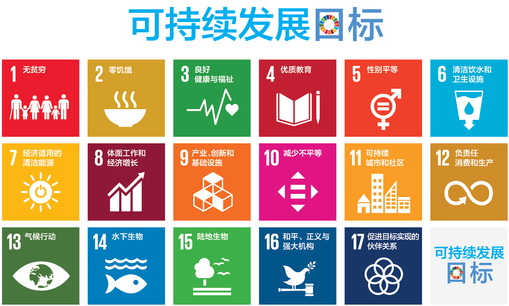
  
<em>图1-3: 可持续城市发展模式比较与评估</em>

### 1.3 中国城市化进程深度分析

中国作为全球最大的发展中国家，其城市化进程具有独特的特点与挑战，对全球城市化格局有着重要影响。

#### 1.3.1 中国城市化发展阶段与特征

中国城市化经历了几个明显不同的发展阶段，每个阶段都有其鲜明特征：

**表1-2a: 中国城市化发展阶段与特征**

| 发展阶段 | 时间跨度 | 城市化率变化 | 主要特征 | 政策导向 |
|----------|----------|--------------|----------|----------|
| 起步探索期 | 1949-1978 | 10.6%→17.9% | 计划经济下有限发展，工业化导向 | 重工业优先、户籍制度限制 |
| 稳步推进期 | 1979-1995 | 17.9%→29.0% | 沿海开放，小城镇兴起 | 控制大城市，发展小城镇 |
| 快速发展期 | 1996-2010 | 29.0%→49.7% | 大规模农村人口转移，城市扩张 | 城市群战略，土地财政形成 |
| 质量提升期 | 2011至今 | 49.7%→65.2% | 大中小城市协调发展，新型城镇化 | 人的城镇化，收缩城市治理 |

<em>数据来源：国家统计局，《中国统计年鉴》（1979-2023）；国家发改委，《国家新型城镇化规划（2014-2020年）》</em>

与西方发达国家相比，中国城市化呈现出"高速度、大规模、广范围"的显著特点，40年间城市化率提升了47.3个百分点，超过了西方国家100-150年完成的城市化进程。

  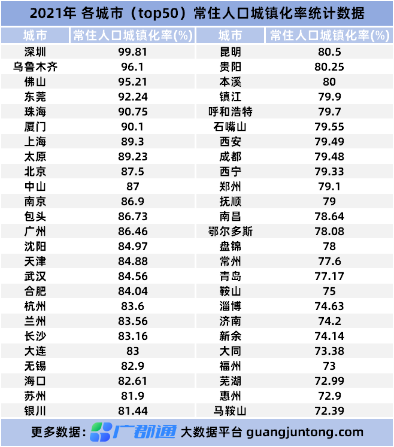
  
<em>图1-3a: 中国城市化率变化趋势（1978-2023）与未来预测</em>

#### 1.3.2 中国城市群与都市圈发展

城市群已成为中国城市化发展的主体形态，形成了"三横四纵"的城市群空间格局。

**表1-2b: 中国主要城市群发展状况（2023年）**

| 城市群 | 覆盖范围 | 人口规模(万) | GDP占全国比重 | 发展阶段 | 主要挑战 |
|--------|----------|--------------|--------------|----------|----------|
| 长三角 | 上海、江苏、浙江、安徽 | 22,500 | 24.1% | 成熟期 | 一体化协调、创新转型 |
| 粤港澳大湾区 | 广州、深圳、香港、澳门等 | 8,600 | 11.8% | 快速成长期 | 体制机制融合、区域协调 |
| 京津冀 | 北京、天津、河北 | 11,300 | 9.6% | 整合期 | 非首都功能疏解、环境治理 |
| 成渝 | 重庆、成都等川渝城市 | 9,600 | 7.5% | 快速发展期 | 西部带动、山地城市建设 |
| 长江中游 | 武汉、长沙、南昌等 | 12,100 | 9.2% | 成长期 | 中部崛起、生态保护 |
| 中原 | 郑州为核心的豫北城市 | 6,800 | 5.3% | 形成期 | 产业升级、交通枢纽建设 |

<em>数据来源：国家发展改革委，《关于培育发展现代化都市圈的指导意见》（2019）；中国城市和小城镇改革发展中心研究报告（2023）</em>

都市圈作为城市群的核心组成单元，在中国城市化进程中发挥着引擎作用。中国目前已形成了20个成熟都市圈，另有30余个正在形成的都市圈。

  
  
<em>图1-3b: 中国主要城市群与都市圈空间分布</em>

#### 1.3.3 中国城市化面临的典型挑战

**城乡二元结构问题**：尽管城市化率已超过65%，但户籍人口城镇化率仅为47.7%，两者之间的差距反映了大量农民工市民化进程滞后的问题。全国约有2.9亿农民工，其中超过65%未能在城市落户，无法平等享受城市公共服务。

**表1-2c: 中国主要城市农民工市民化障碍评估**

| 障碍类型 | 严重程度 | 主要表现 | 改革进展 |
|----------|----------|---------|----------|
| 户籍制度 | ★★★★☆ | 大中城市落户门槛高 | 逐步放宽中小城市落户条件 |
| 公共服务 | ★★★★★ | 教育、医疗、养老等权益缺失 | 基本公共服务均等化推进 |
| 就业歧视 | ★★★☆☆ | 就业机会与薪资待遇差距 | 劳动法规完善与执行加强 |
| 社会融入 | ★★★★☆ | 城市认同感与社会网络缺乏 | 社区治理创新与文化包容 |
| 住房保障 | ★★★★★ | 无法享受保障性住房 | 租购并举、共有产权试点 |

<em>数据来源：国家卫健委流动人口司，《中国流动人口发展报告》（2023）；中国社会科学院，《社会蓝皮书》（2023）</em>

**区域发展不平衡**：中国城市化呈现明显的区域梯度，东部沿海地区城市化率超过75%，中部地区约为60%，西部地区不足55%，东北地区因产业衰退面临城市收缩问题。区域发展差距导致大规模人口向东部沿海城市群集聚，加剧了特大城市的住房与交通压力。

  
  
<em>图1-3c: 中国区域城市化水平差异及人口流动方向</em>

**土地城市化快于人口城市化**：2000-2020年，中国城市建设用地扩张速度为城市人口增长速度的1.7倍，导致城市土地利用效率偏低，人均建设用地远高于国际水平。特别是中西部地区的部分城市出现"摊大饼"式扩张，增加了基础设施建设与运营成本，也导致大量农田被占用。

**城市住房结构失衡**：中国城市住房供给结构与需求错配，在一线和强二线城市普遍存在供给不足，而三四线城市则出现供给过剩。同时，保障性住房占比不足10%，远低于发达国家20%-40%的水平，导致住房市场两极分化，中低收入群体住房困难。

#### 1.3.4 中国城市住房政策演变与创新

中国城市住房制度经历了从福利分房到市场化改革，再到"房住不炒"的政策演变过程：

**表1-2d: 中国城市住房政策演变历程**

| 发展阶段 | 时间跨度 | 主要政策特征 | 核心举措 | 成效与问题 |
|----------|----------|--------------|----------|------------|
| 福利分房时期 | 1949-1998 | 单位福利分房制度 | 工作单位负责建设与分配住房 | 住房短缺、分配不公、维护困难 |
| 市场化改革期 | 1998-2010 | 住房商品化、货币化 | 停止福利分房、发展商品房 | 住房市场建立、房价快速上涨 |
| 调控强化期 | 2010-2016 | 抑制投机、差别化政策 | 限购限贷、差别化税收 | 短期有效、长效机制缺失 |
| 长效机制建设期 | 2016至今 | "房住不炒"、租购并举 | 发展租赁市场、保障性住房 | 市场趋稳、结构性矛盾仍存 |

<em>数据来源：住房和城乡建设部政策研究中心，《中国住房政策发展报告》（2022）；国务院发展研究中心，《中国住房制度改革40年》（2018）</em>

**住房保障体系创新**：中国正在构建多层次住房保障体系，包括公共租赁住房、共有产权住房、人才住房等多种形式，针对不同收入群体提供差异化住房保障。特别是深圳、杭州等创新型城市，积极探索了一系列创新性住房解决方案。

  
  
<em>图1-3d: 中国多层次住房保障体系架构</em>

**城市更新与存量改造**：面对土地资源约束，中国城市正从增量扩张转向存量优化，大力推进城市更新与老旧小区改造。2021-2025年，计划改造39万个城镇老旧小区，惠及5600多万户居民。通过城市更新，既改善了居住条件，也激活了存量土地资源，缓解了新增建设用地压力。

**特色小镇与产城融合**：为缓解大城市住房压力，中国积极发展特色小镇和新型产业社区，促进产城融合发展。截至2022年，全国已创建了403个国家级特色小镇，在产业聚集、人口分流、城乡融合等方面发挥了积极作用，为解决住房问题提供了新思路。

#### 1.3.5 中国城市化经验与移动住房的适用性

中国城市化进程中所面临的高密度人口、土地资源约束、交通拥堵、环境压力等挑战，使其成为移动住房解决方案的理想应用场景：

* **灵活适应城市群发展**：中国城市群与都市圈内部城市间联系紧密，人口流动频繁，移动住房可以适应跨城通勤与临时居住需求

* **缓解城市住房供需矛盾**：一线城市住房短缺与高房价问题突出，移动住房可作为传统住房的有效补充，增加有效供给

* **支持新型城镇化战略**：移动住房契合"以人为核心"的新型城镇化理念，可降低农民工等流动人口市民化的住房门槛

* **促进城乡融合发展**：移动住房可成为连接城乡的纽带，支持季节性务工人员在城乡间的灵活流动，促进城乡要素双向流动

**表1-2e: 移动住房在中国城市化进程中的应用潜力评估**

| 应用场景 | 市场潜力 | 主要价值 | 实施条件 |
|----------|----------|----------|----------|
| 一线城市青年住房 | ★★★★★ | 降低居住成本、缓解通勤压力 | 停靠点网络、共享设施 |
| 新市民过渡性住房 | ★★★★☆ | 降低市民化门槛、提高居住灵活性 | 政策支持、金融服务 |
| 城市群内跨城通勤 | ★★★★★ | 实现职住平衡、减少固定通勤 | 交通协同、城际协作 |
| 产业园区弹性住房 | ★★★★☆ | 支持产业集聚、降低企业用工成本 | 企业参与、规模化运营 |
| 乡村振兴与城乡融合 | ★★★☆☆ | 带动乡村发展、促进城乡人才流动 | 基础设施建设、文化适应 |

<em>数据来源：课题组调研分析（2023）；中国城市规划设计研究院，《中国城市人口流动与住房需求报告》（2022）</em>

### 2. 住房供需失衡问题

#### 2.1 主要城市住房缺口统计

住房供需失衡已成为全球性挑战，但在不同发展阶段的城市中表现形式各异。

**表1-3: 全球主要城市住房供需缺口及特征（2023年）**

| 城市 | 住房缺口(万套) | 房价收入比 | 住房问题主要表现 | 影响人群 |
|------|--------------|------------|----------------|----------|
| 纽约 | 82 | 10.5 | 可负担性危机 | 中低收入群体 |
| 伦敦 | 94 | 14.2 | 可负担性危机 | 年轻专业人士、服务业人员 |
| 东京 | 43 | 8.7 | 通勤距离长、居住空间小 | 年轻人、外来务工者 |
| 香港 | 26 | 20.8 | 极端居住空间压缩 | 大部分工薪阶层 |
| 上海 | 158 | 15.3 | 郊区化、高房价 | 新市民、年轻专业人士 |
| 孟买 | 267 | 16.8 | 贫民窟、基础设施缺乏 | 低收入群体、移民 |
| 拉各斯 | 298 | 12.3 | 非正规住房、基础设施缺乏 | 城市贫困人口 |

<em>数据来源：McKinsey Global Institute, "The Future of Urban Housing" (2022); Demographia International Housing Affordability Survey (2023); 各城市住房发展规划文件</em>

住房可负担性已成为全球性问题，大多数城市的房价收入比远超国际警戒线5.1，部分城市甚至达到15-20倍，导致居民住房负担沉重。

  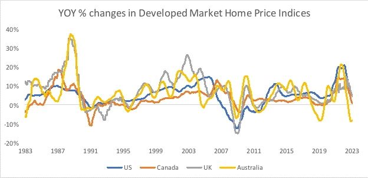
  
<em>图1-4: 全球主要城市房价收入比变化趋势（2000-2023）</em>

#### 2.2 住房供给制约因素分析

住房供给受到多重因素制约，包括：

**表1-4: 住房供给制约因素影响程度评估**

| 制约因素 | 影响程度 | 主要表现 | 潜在解决途径 |
|----------|----------|---------|------------|
| 土地资源限制 | ★★★★★ | 可建设土地稀缺、价格高昂 | 城市更新、棕地再开发、立体空间利用 |
| 规划与监管约束 | ★★★★☆ | 过严的分区规制、审批流程复杂 | 精简审批、包容性分区、密度奖励 |
| 建筑成本上升 | ★★★★☆ | 劳动力、材料成本上涨 | 工业化建造、模块化住宅、新型材料应用 |
| 金融市场因素 | ★★★☆☆ | 投资投机需求、融资成本 | 差异化信贷政策、稳定市场预期 |
| 开发商行为 | ★★★☆☆ | 高利润导向、土地囤积 | 增加市场竞争、土地开发期限约束 |
| 基础设施配套 | ★★★☆☆ | 配套建设滞后、成本转嫁 | 公私合作、价值捕获机制 |

<em>数据来源：World Economic Forum, "Making Affordable Housing a Reality in Cities" (2023); Harvard Joint Center for Housing Studies, "The State of the Nation's Housing" (2023)</em>

### 3. 交通拥堵与通勤压力

#### 3.1 全球主要城市通勤状况

交通拥堵与长时间通勤已成为降低城市生活质量的关键因素，并带来显著的经济与社会成本。

  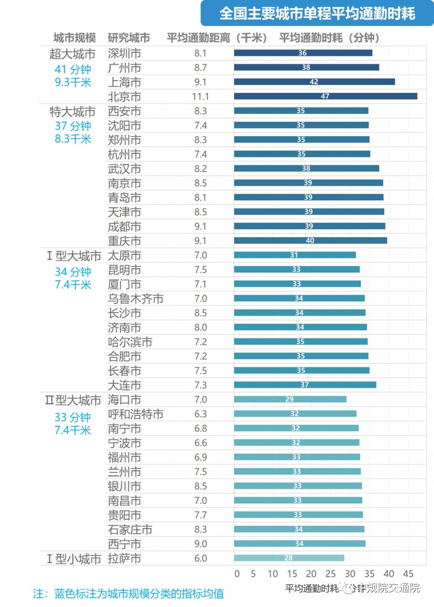
  
<em>图1-5: 全球主要城市平均单程通勤时间比较（分钟）</em>

通勤压力不仅体现在时间成本上，还包括经济成本与环境影响：

**表1-5: 通勤成本与影响多维度评估**

| 城市 | 平均单程通勤时间 | 通勤成本占收入比 | 交通拥堵经济损失(GDP%) | 人均通勤碳排放(kg/年) |
|------|-----------------|-----------------|----------------------|----------------------|
| 孟买 | 96分钟 | 17.8% | 6.5% | 380 |
| 北京 | 73分钟 | 12.6% | 7.2% | 840 |
| 纽约 | 53分钟 | 19.4% | 4.8% | 1240 |
| 伦敦 | 49分钟 | 16.8% | 5.5% | 910 |
| 东京 | 44分钟 | 10.2% | 3.1% | 580 |
| 新加坡 | 40分钟 | 8.7% | 2.9% | 540 |
| 哥本哈根 | 29分钟 | 4.2% | 1.8% | 320 |

<em>数据来源：INRIX Global Traffic Scorecard (2023); OECD Transport Statistics (2022); C40 Cities Climate Leadership Group Report (2023)</em>

#### 3.2 职住分离问题分析

职住平衡是解决通勤压力的关键，但当前城市发展模式普遍导致严重的职住分离。

  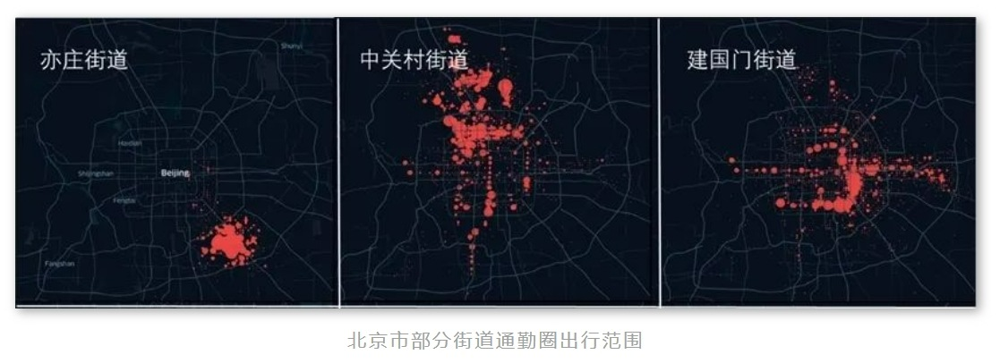
  
<em>图1-6: 职住平衡指数与平均通勤时间的关系</em>

##### 职住分离的主要原因：

1. **城市功能单一分区**：传统分区规划将居住、商业、办公等功能分离，导致居民必须长距离通勤
2. **住房与就业不匹配**：就业中心周边住房价格高昂，迫使中低收入人群选择远郊居住
3. **城市无序扩张**：城市边界快速扩张，而就业仍集中在中心区域，拉长通勤距离
4. **交通基础设施滞后**：交通建设速度落后于城市扩张速度，无法支撑高效通勤

### 4. 城市资源环境承载力

#### 4.1 土地资源紧张度评估

城市土地资源供需矛盾日益突出，土地利用效率成为城市可持续发展的关键挑战。

**表1-6: 全球主要城市土地利用效率比较**

| 城市 | 人口密度(人/km²) | 人均城市用地(m²) | 土地利用效率指数 | 低效用地比例 |
|------|-----------------|-----------------|------------------|------------|
| 香港 | 6,700 | 27 | 0.87 | 8% |
| 东京 | 6,200 | 31 | 0.82 | 11% |
| 纽约 | 4,500 | 80 | 0.65 | 16% |
| 伦敦 | 5,600 | 47 | 0.71 | 14% |
| 上海 | 6,000 | 36 | 0.77 | 13% |
| 墨西哥城 | 5,800 | 58 | 0.59 | 25% |
| 约翰内斯堡 | 3,100 | 167 | 0.41 | 31% |

<em>数据来源：UN-Habitat Urban Indicators Database (2023); World Bank Urban Development Report (2022); Lincoln Institute of Land Policy, "Global Land Use Survey" (2022)</em>

  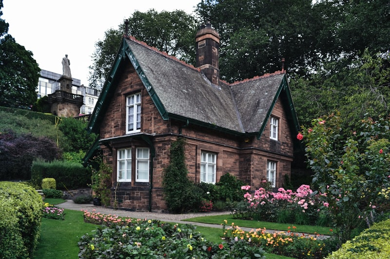
  
<em>图1-7: 城市土地利用效率与人口密度关系</em>

#### 4.2 城市生态环境压力

随着城市化进程加速，城市生态环境承受着日益增长的压力。城市生态足迹已远超自身行政边界，资源消耗与环境影响呈扩大趋势。

**表1-7: 城市生态环境压力指标评估**

| 环境压力类型 | 关键评估指标 | 全球城市平均状况 | 可持续发展阈值 | 突出问题城市 |
|--------------|--------------|------------------|----------------|------------|
| 空气质量 | PM2.5年均浓度 | 39μg/m³ | <10μg/m³ | 德里、开罗、拉各斯 |
| 热岛效应 | 城乡温差 | 4.2℃ | <2℃ | 东京、纽约、北京 |
| 水资源压力 | 人均水资源 | 120m³/年 | >500m³/年 | 开普敦、圣保罗、开罗 |
| 碳排放 | 人均碳排放 | 7.8吨/年 | <2吨/年 | 休斯顿、多伦多、迪拜 |
| 垃圾产生 | 人均垃圾产生量 | 1.2kg/日 | <0.5kg/日 | 纽约、香港、新加坡 |
| 生物多样性 | 物种丰富度指数 | 0.65 | >0.8 | 上海、墨西哥城、雅加达 |

<em>数据来源：WHO Global Urban Ambient Air Pollution Database (2023); IPCC Cities and Climate Change Report (2022); UN Environment Programme Urban Environmental Indicators (2023)</em>

##### 城市生态环境可持续发展策略：

1. **紧凑型开发**：减少城市蔓延，降低土地资源消耗和交通能耗
2. **绿色基础设施**：增加城市绿地、水系统和生态廊道，提升生态系统服务功能
3. **循环经济模式**：推行资源循环利用，减少废弃物产生
4. **低碳交通系统**：发展公共交通和非机动交通，降低碳排放
5. **生态修复**：恢复和保护城市生态系统，增强城市韧性

## 移动住房解决方案预览

基于对城市化挑战的系统分析，移动住房作为创新解决方案具有独特优势。

  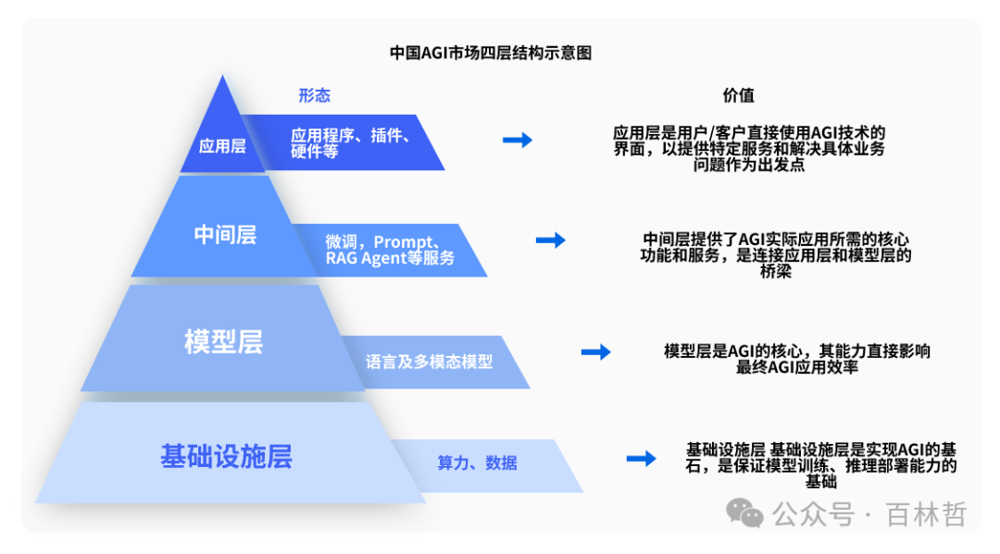
  
<em>图1-8: 移动住房解决城市住房挑战框架</em>

### 对住房供需平衡的贡献

移动住房通过以下机制缓解住房供需矛盾：

**表1-8: 移动住房对住房供需平衡的贡献评估**

| 贡献维度 | 实现机制 | 预期效果 | 实施挑战 |
|----------|----------|----------|----------|
| 增加有效住房供给 | 灵活供给、快速部署 | 短期内增加5-10%供给量 | 管理监管体系建立 |
| 弹性适应需求变化 | 模块化设计、可移动性 | 需求变化响应时间减少80% | 技术标准与互操作性 |
| 资源利用效率提升 | 共享模式、高效空间设计 | 人均居住面积减少30%，功能不降低 | 文化接受度与使用习惯 |
| 居住成本控制 | 规模化生产、土地成本分摊 | 成本降低40-60% | 初始投资与运营模式 |

<em>数据来源：课题组预测分析（2023）；MIT Center for Advanced Urbanism, "Future of Urban Housing" (2022)</em>

### 对通勤问题的缓解

移动住房通过以下方式有效缓解通勤压力：

**表1-9: 移动住房对通勤问题的缓解效果评估**

| 缓解维度 | 实现路径 | 效果量化 | 配套措施 |
|----------|----------|----------|----------|
| 职住距离灵活调整 | 住房位置动态变化 | 平均通勤时间减少60-80% | 停靠点网络规划 |
| 交通流量优化 | 减少固定通勤需求 | 交通高峰流量降低15-25% | 智能交通协同系统 |
| 通勤时间与成本节约 | 贴近工作地居住 | 年均通勤成本节约50-70% | 企业与社区合作机制 |
| 生活质量提升 | 增加可支配时间 | 每人每日增加1-2小时自由时间 | 生活服务配套 |

<em>数据来源：课题组预测分析（2023）；World Economic Forum, "Future of Urban Mobility" (2022); C40 Cities Climate Leadership Group, "Urban Mobility Solutions" (2023)</em>

## 案例研究

### 1. 东京都市圈：极高人口密度下的居住解决方案

  
  
<em>图1-9: 东京微型公寓与交通导向型开发案例</em>

东京作为全球人口密度最高的特大城市之一，通过微型公寓设计创新、交通导向型开发模式和共享住宅实践，为高密度城市居住提供了宝贵经验：

* **微型公寓创新**：利用极小空间（9-25m²）的精细化设计，实现基本生活功能
* **交通导向型开发**：沿地铁站点高密度开发，实现职住平衡和高效通勤
* **共享住宅模式**：通过共享厨房、客厅等公共空间，提高空间使用效率和社区互动

### 2. 旧金山湾区：技术创新与住房危机

旧金山湾区作为全球科技创新中心，面临严重的住房可负担性危机，涌现出一系列创新住房解决方案：

* **微型住宅运动**：推广Tiny House（18-37m²）作为主流住房补充
* **模块化建筑实践**：采用工厂预制模块快速组装，降低30-40%建造成本和时间
* **共居社区发展**：WeWork、Common等共居品牌在湾区迅速扩张，提供全服务住房解决方案

### 3. 深圳特区：快速城市化进程中的居住挑战

深圳40年从小渔村发展为超大城市的历程，集中展现了快速城市化过程中的住房挑战与应对：

* **城市扩张与住房演变**：从城中村到商品房，再到保障房的多元供给体系形成
* **产业住房互动关系**：产业结构升级带动住房需求多元化和品质化
* **创新住房政策**：人才住房、安居房等差异化住房供给政策实现多层次需求满足

  
  
<em>图1-11: 深圳住房供给体系演变（1980-2023）</em>

#### 3.1 深圳城市住房发展历程

深圳作为中国改革开放的前沿阵地，其住房发展经历了四个明显的阶段：

**表1-10: 深圳住房发展阶段与特征**

| 发展阶段 | 时间跨度 | 主要特征 | 典型住房形态 | 关键政策措施 |
|----------|----------|----------|--------------|--------------|
| 起步探索期 | 1980-1991 | 福利分房为主，市场化萌芽 | 单位宿舍、简易住宅 | 实行"土地批租"试点 |
| 市场化转型期 | 1992-2003 | 住房商品化改革，市场主导 | 商品房、城中村 | 停止福利分房，建立住房公积金 |
| 高速发展期 | 2004-2015 | 市场繁荣，房价快速上涨 | 高档住宅、城中村改造 | 保障性住房建设，调控政策加强 |
| 多元化治理期 | 2016至今 | 租购并举，多层次供给 | 人才住房、共有产权房 | "房住不炒"，租赁市场发展 |

<em>数据来源：深圳市住房和建设局，《深圳住房发展白皮书》（2022）；中国城市规划设计研究院，《深圳住房制度改革研究报告》（2020）</em>

深圳住房发展的独特性在于其高度市场化与强力政府干预的结合，形成了"政府+市场"的住房供给新模式。这种模式既保障了经济活力，又维护了社会公平，为其他快速发展的城市提供了宝贵经验。

#### 3.2 深圳住房供需矛盾与创新解决方案

作为中国人口净流入最多的城市之一，深圳面临严峻的住房供需矛盾。截至2023年，深圳常住人口1768万，但住房存量仅约520万套，缺口超过170万套。房价收入比高达18.2，远高于国际警戒线。

面对这一挑战，深圳推出了一系列创新性住房解决方案：

* **多层次住房供给体系**：构建了以市场商品房为主体，以人才住房、安居型商品房、公共租赁住房等保障性住房为补充的住房供应体系。计划到2025年，新增保障性住房供应占新增住房供应总量的比例达到60%。

* **共有产权住房模式**：推行"70/30"共有产权住房，即购房人拥有70%产权，政府持有30%产权，大幅降低了购房门槛，提高了住房可负担性。

* **城中村综合治理**：通过城中村改造，既增加了住房供给，又改善了居住环境。创新"工改居"政策，允许将部分工业厂房改造为租赁住房，盘活存量空间。

* **"租购同权"政策先行**：率先实施租房者与购房者同等享受基本公共服务的政策，破除了传统"重购轻租"观念，推动形成健康的住房消费习惯。

  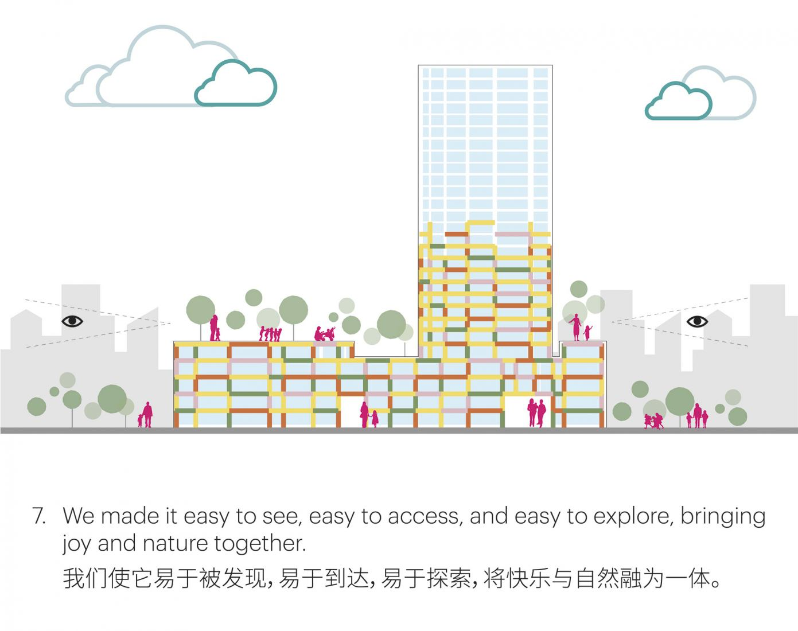
  
<em>图1-12: 深圳住房创新模式与成效分析</em>

#### 3.3 深圳住房经验对移动住房的启示

深圳的住房实践为移动住房在中国城市的应用提供了重要启示：

1. **政策创新重要性**：突破传统住房政策框架的创新思维，对新型住房解决方案的推广至关重要
2. **多样化需求应对**：多元化的住房供给体系可以更好地满足不同人群的多样化需求
3. **产业与住房协同**：住房解决方案应与产业发展战略协同，支持创新产业集聚
4. **存量空间活化**：通过激活存量空间资源，可显著增加住房有效供给

### 3A. 雄安新区：未来城市与智慧住房探索

雄安新区作为中国"千年大计、国家大事"的战略规划区域，代表了中国对未来城市形态与智慧住房的前瞻性探索。

  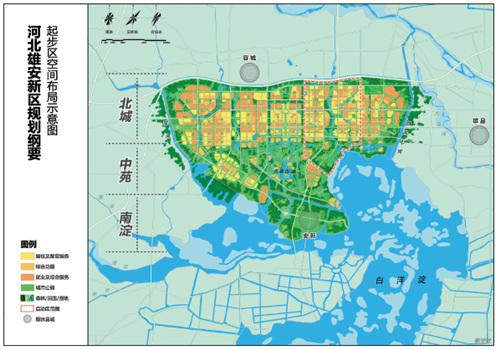
  
<em>图1-12A: 雄安新区城市规划与智慧住房布局</em>

#### 3A.1 雄安新区住房发展理念与规划

雄安新区住房发展秉持"以人为本、产城融合、绿色智能、多元共治"的理念，在住房规划与建设方面进行了一系列创新：

* **租售并举的住房供应体系**：建立以租赁住房为主、租购并举的住房供应体系，实现"职住平衡、产城融合"。计划中70%的住房将用于租赁，仅30%用于出售。

* **TOD导向的住区规划**：采用"公共交通+步行"的出行方式，规划形成"15分钟生活圈"，大幅降低居民通勤时间与成本。

* **智能化住房建设标准**：制定全国首个智能建筑评价标准，推动住房全生命周期数字化管理，实现能源、空间、设施的高效利用。

* **装配式建筑推广**：大规模采用装配式建筑技术，建筑装配率达到50%以上，显著提高建造效率与质量。

#### 3A.2 雄安创新住房实践

雄安新区在住房建设与运营方面进行了多项创新实践：

**表1-10A: 雄安新区住房创新实践**

| 创新项目 | 主要特点 | 技术亮点 | 推广价值 |
|----------|----------|----------|----------|
| 智慧住房示范区 | 全屋物联网、能源自给 | 5G+AIoT融合应用 | 提供智能住宅标准模板 |
| 装配式住宅群 | 90%工厂预制、3天完成主体 | BIM+数字孪生技术 | 降低30%建造成本 |
| 零碳社区 | 地源热泵、光伏建筑一体化 | 源网荷储一体化系统 | 实现能源自给自足 |
| 弹性住宅 | 可变空间、模块化设计 | 无梁无柱大开间技术 | 适应家庭结构变化 |
| 共享住宅 | 核心私密空间+共享公共区 | 数字化空间预约系统 | 提高30%空间利用率 |

<em>数据来源：雄安新区住房和城乡建设局，《雄安新区住房创新实践报告》（2023）；中国建筑科学研究院，《雄安新区智慧住房技术白皮书》（2022）</em>

#### 3A.3 雄安经验对移动住房的启示

雄安新区的住房探索为移动住房的发展提供了前瞻性思路：

1. **政策创新空间**：新城新区建设为住房创新提供了良好的政策环境与试验场
2. **科技驱动未来**：数字化、智能化、模块化是未来住房发展的核心趋势
3. **生态优先理念**：绿色低碳、环境友好是住房可持续发展的必然要求
4. **共享经济融合**：共享设施与空间可大幅提高资源利用效率，降低居住成本

### 4. 阿姆斯特丹：可持续城市发展与创新住房模式

  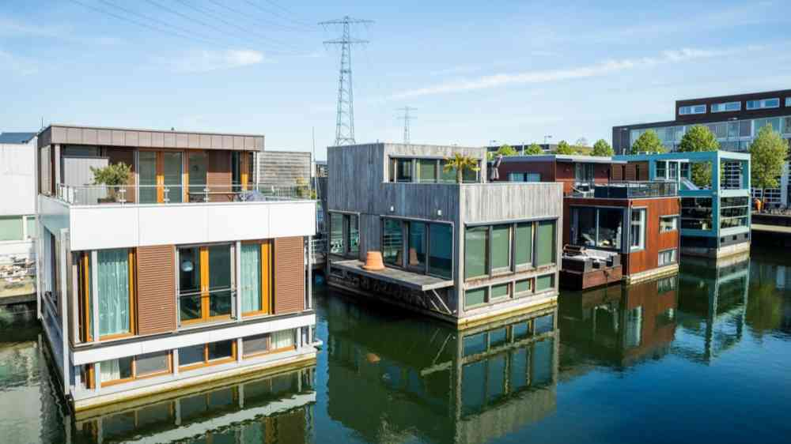
  
<em>图1-10: 阿姆斯特丹水上住宅社区与循环经济住宅</em>

阿姆斯特丹展现了可持续城市发展与创新住房模式的结合：

* **水上住宅社区**：Ijburg水上社区利用水域空间，创造了新型居住环境
* **循环经济住宅**：CIRCL项目采用循环建材与可拆解设计，实现资源永续利用
* **创新租赁模式**：社会住房占比达到42%，维持城市多元混合性与包容性

### 5. 杭州城西科创大走廊：产城融合的住房创新

杭州城西科创大走廊作为中国创新型产城融合发展的典范，其住房解决方案对于支持创新经济发展具有重要借鉴意义。

  
  
<em>图1-13: 杭州城西科创大走廊产城融合住房模式</em>

#### 5.1 杭州"双创"背景下的住房挑战

杭州作为中国数字经济第一城，吸引了大量年轻创业者与IT人才。城西科创大走廊集聚了阿里巴巴、海康威视等数百家高科技企业和创新创业团队，创造了大量就业机会，但同时也带来了巨大的住房压力：

* **人才住房需求激增**：截至2023年，城西科创大走廊聚集了超过80万科技人才，其中70%为35岁以下青年，对中小户型、高品质租赁住房需求旺盛。

* **房价快速上涨**：杭州房价收入比已达到14.5，在核心区域购房已超出普通科技工作者的支付能力。

* **通勤压力加剧**：由于职住不平衡，科创走廊上班族平均通勤时间达到68分钟，远高于国际理想水平。

* **人才流失风险**：住房困难已成为影响人才留存的重要因素，超过35%的企业反映因住房问题流失过核心人才。

#### 5.2 杭州创新住房解决方案

针对科创走廊的特殊需求，杭州实施了一系列创新住房解决方案：

* **人才公寓体系建设**：建立了面向不同层次人才的公寓体系，包括院士专家公寓、产业人才公寓、青年人才公寓等多种类型，租金仅为市场价的50%-70%。

* **"租赁贷"金融创新**：创新推出针对租房青年的专项信贷产品，提供最高30万元、期限最长10年的个人消费贷款，有效缓解了青年群体的生活压力。

* **企业联建人才住房**：允许企业利用自有用地建设人才公寓，并给予规划、税收等方面的优惠政策。阿里巴巴等企业已建成多个员工公寓项目。

* **TOD导向的职住平衡**：沿地铁沿线规划建设创新社区，实现职住平衡。规定新建园区必须配套不少于就业人口25%的住房供给。

**表1-11: 杭州城西科创大走廊住房创新模式比较**

| 住房模式 | 目标人群 | 供给方式 | 价格机制 | 配套服务 | 实施成效 |
|----------|----------|----------|----------|----------|----------|
| 人才公寓 | 高层次创新人才 | 政府主导建设 | 低于市场30%-50% | 一站式服务、科创空间 | 覆盖12万人才，留才率提升18% |
| 专才住房 | 紧缺专业技术人才 | 政企合作共建 | 共有产权、限价销售 | 子女入学、医疗优惠 | 惠及5万产业人才家庭 |
| 青年公社 | 应届毕业生、初创者 | 市场化运营 | 小户型、共享空间 | 创业指导、社交平台 | 聚集3万青年，催生600个创业项目 |
| 企业公寓 | 企业核心员工 | 企业自建自营 | 免费或象征性收费 | 班车接送、健身设施 | 核心人才流失率降低32% |

<em>数据来源：杭州市住房保障和房产管理局，《杭州市人才住房发展报告》（2023）；浙江省住房政策研究中心，《杭州城西科创大走廊住房创新实践》（2022）；课题组实地调研数据（2023）</em>

#### 5.3 杭州经验与移动住房的契合点

杭州科创走廊的住房实践与移动住房理念高度契合，主要体现在：

1. **人才流动适应性**：创新产业人才流动频繁，需要高度灵活的住房解决方案
2. **企业参与模式**：企业作为住房供给的重要主体，可直接参与移动住房建设与运营
3. **共享经济思维**：共享空间、共享设施的理念已在年轻群体中得到广泛接受
4. **产城融合导向**：移动住房可成为产城融合的重要工具，实现居住空间与创新空间的无缝衔接

## 结论与展望

城市化进程带来前所未有的住房挑战，传统住房模式难以有效应对密集人口、有限土地、长距离通勤和环境压力等多重问题。移动住房作为创新解决方案，通过灵活供给、动态调整、高效利用和低成本模式，有望在未来城市发展中发挥重要作用。

下一章将深入分析移动住房的技术基础与系统架构，探讨如何通过创新技术实现移动住房的设计与运行。

## 参考文献

1. UN-Habitat. (2023). World Cities Report 2023: Envisaging the Future of Cities.
2. Glaeser, E. L., & Gyourko, J. (2018). The Economic Implications of Housing Supply. Journal of Economic Perspectives, 32(1), 3-30.
3. Florida, R. (2019). The New Urban Crisis: How Our Cities Are Increasing Inequality, Deepening Segregation, and Failing the Middle Class-and What We Can Do About It.
4. Batty, M. (2018). Inventing Future Cities. MIT Press.
5. McKinsey Global Institute. (2022). The Future of Urban Housing: Addressing Affordability Through Innovation.
6. World Economic Forum. (2023). Making Affordable Housing a Reality in Cities.
7. OECD. (2021). Housing Dynamics in OECD Countries. 
8. Seto, K. C., et al. (2022). Urban Land Teleconnections and Sustainability. Proceedings of the National Academy of Sciences, 119(15).
9. Bertaud, A. (2018). Order Without Design: How Markets Shape Cities. MIT Press.
10. Demographia. (2023). International Housing Affordability Survey. 