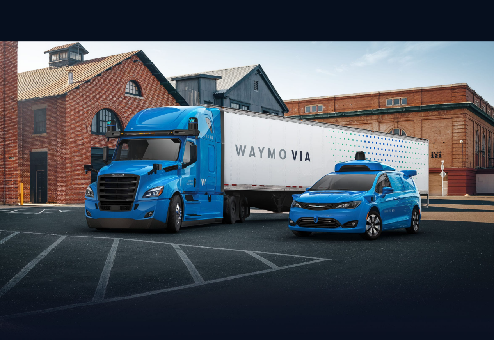

# 第1章 移动住房时代的到来

> "安得广厦千万间，大庇天下寒士俱欢颜！" —— 杜甫《茅屋为秋风所破歌》

## 📖 章节概述

漂泊的游子，在市中心租房有可能低于1000元吗？
无论在何处上班，可以下班后步行几分钟就能到家吗？
父母可以让自动驾驶汽车接送孩子上下学吗？
飞屋环球旅行真的是遥不可及的梦想吗？

读完本章，这些问题你都会有个清晰的答案。本章将带你穿越人类住房发展的历史长河，从原始的茅草屋到现代的摩天大楼，再到即将到来的移动智能住宅，探索住房形式背后的技术进步、社会变迁和人类需求的演化。


*图1-1：人类住房发展的历史演进*

---

## 1.1 住房发展的四个时代

### 📊 住房发展时代对比表

| 时代 | 时间跨度 | 主要材料 | 核心特征 | 使用寿命 | 主要问题 |
|------|----------|----------|----------|----------|----------|
| 第一代 | 史前-工业革命前 | 茅草、木材、泥土 | 就地取材、环保 | 5-20年 | 耐久性差、舒适度低 |
| 第二代 | 工业革命-20世纪中期 | 砖瓦、木材、玻璃 | 标准化、工艺化 | 50-100年 | 成本上升、资源消耗 |
| 第三代 | 20世纪中期-21世纪初 | 钢筋混凝土、玻璃 | 高层化、现代化 | 50-70年 | 高房价、维护困难 |
| 第四代 | 21世纪初-未来 | 复合材料、智能材料 | 移动化、智能化 | 30-50年 | 技术完善中 |

### 1.1.1 第一代住房：就地取材的智慧

**时间跨度：史前时代至工业革命前**

公元761年，饱受流离之苦的杜甫曾发出"安得广厦千万间"的感叹。和追求昆仑奴、新罗婢、菩萨蛮的长安子弟不同，他选择了为苍生代言。身处盛唐，老爷子的生活却相当窘迫，在友人的资助下才得以建成暂时栖身的草堂。


*图1-2：第一代住房代表 - 传统住房*

第一代住房的特点是**就地取材，与自然和谐**。我们的祖先用茅草、木材、泥土搭建起遮风挡雨的家园。这些传统建筑有着令人惊叹的环保特性：
- 建造时零工业污染
- 使用时与环境和谐共生  
- 废弃后完全可降解回归自然

但第一代住房也有明显的局限性：
- **耐久性差**：一场大火、一次洪水就可能让房子化为乌有
- **舒适度低**：冬冷夏热，保温隔音效果差
- **功能单一**：主要解决遮风挡雨的基本需求

### 1.1.2 第二代住房：工业化的标准

**时间跨度：工业革命至20世纪中期**

随着工业革命的到来，人类掌握了更先进的建造技术。砖瓦的标准化生产、玻璃窗户的普及、给排水系统的建立，这些技术进步彻底改变了住房的面貌。

北京的四合院就是第二代住房的典型代表。青砖灰瓦，雕梁画栋，不仅美观实用，而且能够传承数代。这个时期最重要的变化是**标准化**的出现：
- 砖的尺寸有了统一标准
- 建造工艺有了规范流程
- 房地产市场开始形成


*图1-3：第二代住房代表 - 四合院*

第二代住房的优势：
- **耐久性提升**：精心建造的房子可以使用几十年甚至上百年
- **功能完善**：具备了完整的居住功能
- **工艺精美**：注重美观和文化内涵

但也带来了新问题：
- **成本上升**：建造成本显著增加
- **资源消耗**：对自然资源的消耗大幅增加
- **地域限制**：固定在特定位置，无法移动

### 1.1.3 第三代住房：向天空要空间

**时间跨度：20世纪中期至21世纪初**

当城市人口急剧增长，土地变得稀缺昂贵时，人类选择了向天空发展。钢筋混凝土的发明，让建造摩天大楼成为可能。电梯的普及，让人们可以舒适地生活在几十层的高空中。

第三代住房的代表是现代公寓楼。在一栋30层的住宅楼里，可以容纳数百个家庭，这在过去是不可想象的。


*图1-4：第三代住房代表 - 现代公寓*

**第三代住房的优势：**
- **空间效率高**：在有限土地上容纳更多人口
- **设施现代化**：电梯、空调、宽带网络等现代设施
- **城市便利性**：靠近工作和商业中心

**但也创造了前所未有的问题：**

| 问题类型 | 具体表现 | 数据支撑 |
|---------|---------|---------|
| 经济负担 | 房价飞涨 | 一线城市房价收入比达20-30倍 |
| 环境影响 | 建筑能耗高 | 占社会总能耗30%以上 |
| 社会问题 | 邻里关系淡漠 | 社区归属感缺失 |
| 维护困难 | 管线老化 | 30年后跑冒滴漏成常态 |

**高层建筑的维护难题：**

高层建筑采用钢筋混凝土浇筑方式，各种管线和混凝土浇筑在一起。质量达标的混凝土使用30-50年没问题，可内部管线的寿命大都撑不到30年。所以，过了"保质期"，各类管线就会出现跑冒滴漏现象，维修起来难上加难。漏水了、漏电了、电梯故障了、墙体裂缝了，问题层出不穷。**高楼大厦适合商用，不太适合民居。**

### 1.1.4 第四代住房：移动智能的新时代

**时间跨度：21世纪初至未来**

正当人们为高房价、环境污染、社会疏离而苦恼时，一种全新的住房形式悄然兴起——移动住房。这不是简单的房车或拖车，而是集成了最新科技的智能移动家园。

2011年是智能手机爆发年，到如今持续了10年，硬件、软件、通信等层面都积累了大量技术，为下一个10年甚至20年——移动房时代做好了铺垫。


*图1-5：第四代住房代表 - 移动住房*

---

## 1.2 移动住房的三大核心特征

真正意义上的移动房，至少应有三个特性：

### 🚛 1.2.1 移动化：自由迁徙的能力

**与传统房车的区别：**

自行式房车有良好的移动性，但引入了动力系统使成本大幅增加。长时间停放的话，动力系统是闲置的，资源浪费。

集装箱房自身没有移动性，借助拖车和起重机才可以移动。"需要起重机"这一点使其移动性打折，限制了移动场景。

**移动住房的移动性优势：**
- 无需起重机，可通过半挂车运输
- 符合GB 1589-2016道路运输标准
- 城际搬家成本约1000元
- 搬迁时间1-2天即可完成

### 🧩 1.2.2 模块化：积木式的设计智慧

移动房的墙体、水箱、管道等各部件都是可拆卸更换的模块，方便维修和配件升级。模块化设计能够避免一处损坏，全体换修的问题。**这个优势足够吊打传统不动房！**

**模块化的实际优势：**
- 单个模块故障不影响整体使用
- 可根据需求灵活增减功能模块
- 维修成本大幅降低
- 支持渐进式升级改造

### 🔌 1.2.3 接口化：标准化的补给系统

水、电、燃气、氢气、光纤，均为标准化接口，可以和营地接口桩或移动补给车连接。相同价格条件下，首选补给便捷的营地接口桩。没有接口桩的地方，可以预约补给车。**补给净水、氢气、天然气、回收污水和生活垃圾如同点外卖，大约一至两周一次。**

---

## 1.3 移动住房的舒适度标准

房子的舒适度主要取决于三个因素：

### 🌡️ 1.3.1 保温性：能耗与舒适的平衡

保温好则能耗低，利于室温冬暖夏凉，体感和睡眠才会舒适。

**移动住房保温设计：**

```
┌─────────────────────────────────────┐
│          三明治墙体结构图              │
├─────────────────────────────────────┤
│ 外层：铝合金/玻璃钢 (5mm)            │
│ ├─ 坚固耐热，防腐蚀                  │
├─────────────────────────────────────┤
│ 中层：聚氨酯硬泡板 (40mm)            │
│ ├─ 保温隔热，吸音降噪                │
├─────────────────────────────────────┤
│ 内层：木塑板 (5mm)                   │
│ ├─ 防虫防潮，环保美观                │
└─────────────────────────────────────┘
总厚度：50mm  防燃等级：B1级
```


*图1-6：移动住房三明治墙体结构*

**保温性能参数：**

| 指标 | 数值 | 标准 |
|------|------|------|
| 导热系数 | 0.024 W/(m·K) | ≤0.030 |
| 保温效率 | 95% | ≥90% |
| 隔音效果 | 45dB | ≥40dB |
| 防火等级 | B1级 | ≥B2级 |

### 🌬️ 1.3.2 空气质量和采光：健康生活的基础

通风和采光良好，使人呼吸顺畅，身心愉悦。当暖暖的阳光洒进室内，让人倍感治愈。

**设计标准：**
- 窗户面积占墙面比例≥30%
- 新风系统换气次数≥0.5次/小时
- PM2.5过滤效率≥99%

### 🚿 1.3.3 卫生间质量：生活品质的决定因素

这一点，甚至是生活品质的决定性因素。曾有人说：**厕所发展史=人类文明发展史**，一点儿也不夸张。发达国家和发展中国家的差距，最直接的体现就是厕所水平，城乡差距也是如此。

**移动住房卫生间设计要求：**
- 三室分离：更衣、洗浴、如厕独立
- 干湿分离，防止潮湿
- 配备洗烘一体机
- 智能马桶，提升使用体验

---

## 1.4 移动住房的经济可行性分析

### 💰 1.4.1 建造成本分析

以移动房概要设计的尺寸11×2.5×3m来计算（价格估算参考网商平台相似物品售价，取中等价位）：

| 项目 | 规格 | 单价 | 数量 | 小计(元) |
|------|------|------|------|----------|
| 房体钢架和管道布线 | 标准规格 | - | 1套 | 10,000 |
| 墙体材料 | 244.5㎡ | 300元/㎡ | 244.5㎡ | 73,350 |
| 升降外围墙体电机 | 含滑轮、绞线 | - | 1套 | 1,000 |
| 水箱、过滤箱、增压泵 | 标准配置 | - | 1套 | 3,000 |
| 五金锁扣、合页 | 优质五金 | 20元/件 | 100件 | 2,000 |
| **裸房成本小计** | | | | **89,350** |
| 人工成本和运输成本 | | | | 20,000+ |
| **总成本** | | | | **≈11万元** |

**规模化生产后的成本优化：**
参考特斯拉经验，规模化生产后有30%降价空间，即最终的销售价格区间应该在**6-8万元**。配置齐全各种普通家具家电，价格可以控制在**20万以内**，可使用年限30年以上。

### 📊 1.4.2 使用成本分析

**年度使用成本明细：**

| 费用项目 | 月费用(元) | 年费用(元) | 备注 |
|----------|------------|------------|------|
| 电费 | 220 | 2,640 | 普通三口之家 |
| 水费 | 100 | 1,200 | 包含净水和污水处理 |
| 燃气费 | 80 | 960 | 液化气 |
| 网费 | 100 | 1,200 | 4G/5G移动上网 |
| 营地租金 | 167 | 2,000 | 郊区营地 |
| **年度总计** | **667** | **8,000** | 城际搬家另计1000元/次 |

**对比传统住房：**
- 传统住房年租金：36,000-60,000元（一线城市一居室）
- 移动住房年成本：8,000-10,000元
- **节省比例：80-85%**

### 📈 1.4.3 投资回报分析

**购买vs租房对比（以北京为例）：**

| 方案 | 初始投资 | 年度费用 | 10年总成本 | 资产价值 |
|------|----------|----------|------------|----------|
| 移动住房 | 20万元 | 1万元 | 30万元 | 15万元 |
| 租房(一居室) | 0 | 4.8万元 | 48万元 | 0 |
| **节省金额** | | | **18万元** | **15万元** |

**投资回报率计算：**
```
年化收益率 = (节省金额 + 资产价值) / 投资期间 / 初始投资
           = (18万 + 15万) / 10年 / 20万
           = 16.5%
```

---

## 1.5 移动住房的应用场景

### 🏡 1.5.1 农村场景：最佳应用环境

移动房的最佳应用场景在农村，放在自家院子里，想怎么整就怎么整，没有物业费。**宅基地很重要，户口对高考而言没那么重要！**

**农村应用优势：**
- 无停车费用
- 无物业管理费
- 土地使用权明确
- 环境优美，空气清新
- 可配套种植养殖


*图1-7：农村移动住房应用场景*

**农村移动房配置建议：**

| 配置项目 | 标准配置 | 升级配置 | 豪华配置 |
|----------|----------|----------|----------|
| 太阳能板 | 3kW | 5kW | 8kW |
| 储能电池 | 10kWh | 20kWh | 30kWh |
| 净水系统 | 基础过滤 | RO反渗透 | 全屋净化 |
| 取暖系统 | 空气能热泵 | 地暖+热泵 | 智能恒温 |
| 总价格 | 15万元 | 25万元 | 35万元 |

### 🏙️ 1.5.2 城市场景：郊区营地模式

城市场景则是郊区的移动房营地，但居住不应像房车营地那样密集，缺乏隐私空间。应该带有栅栏和门禁，**70+平米草地一户**，安全和舒适俱备。

**营地设计要求：**
- 每户占地面积≥70㎡
- 栅栏+花刺墙设计（月季、蔷薇等带刺植物）
- 夜视监控摄像头
- 24小时安保服务
- 标准化水电燃气接口

**营地发展阶段：**

| 阶段 | 特点 | 价格水平 | 主要问题 |
|------|------|----------|----------|
| 前期 | 标准化营地稀少 | 较高 | 补给依赖移动车辆 |
| 中期 | 营地增多但竞争不足 | 仍然较高 | 价格垄断，使用率低 |
| 后期 | 设施完善，竞争充分 | 合理 | 成为主流选择 |

**营地布局示意图：**
```
┌─────────────────────────────────────────────┐
│                营地总平面图                  │
├─────────────────────────────────────────────┤
│  [管理中心]    [补给站]    [公共设施]        │
│      │           │           │              │
│  ┌───┴───┐   ┌───┴───┐   ┌───┴───┐        │
│  │ 70㎡  │   │ 70㎡  │   │ 70㎡  │        │
│  │ 住户A │   │ 住户B │   │ 住户C │        │
│  └───────┘   └───────┘   └───────┘        │
│                                             │
│  ┌───────┐   ┌───────┐   ┌───────┐        │
│  │ 70㎡  │   │ 70㎡  │   │ 70㎡  │        │
│  │ 住户D │   │ 住户E │   │ 住户F │        │
│  └───────┘   └───────┘   └───────┘        │
└─────────────────────────────────────────────┘
```


*图1-8：移动住房营地规划示意*

### 🏖️ 1.5.3 旅游场景：移动度假新模式

移动住房为旅游业带来了全新的可能性：
- 可以追随最佳季节和天气
- 避开旅游旺季的高价酒店
- 享受更私密的度假体验
- 可以深入传统旅游难以到达的地区

**旅游应用成本分析：**

| 旅游方式 | 7天费用 | 30天费用 | 优缺点 |
|----------|---------|----------|--------|
| 传统酒店 | 3,500元 | 15,000元 | 舒适但昂贵 |
| 民宿短租 | 2,100元 | 9,000元 | 性价比中等 |
| 移动住房 | 700元 | 3,000元 | 经济实惠，自由度高 |

---

## 1.6 技术成熟度评估

### 🔬 1.6.1 现有技术基础

移动房所需的生产工艺成熟，体积仅有公交车大小，因此生产、停放都不是瓶颈问题，**难点是补给**。

**技术成熟度分析：**

| 技术领域 | 成熟度 | 应用现状 | 发展前景 |
|----------|--------|----------|----------|
| 轻量化材料 | 95% | 广泛应用于房车制造 | 成本持续下降 |
| 模块化设计 | 90% | 集装箱房已验证 | 标准化程度提升 |
| 智能控制 | 85% | 智能家居技术成熟 | 集成度不断提高 |
| 可再生能源 | 80% | 太阳能技术成熟 | 效率持续提升 |
| 补给系统 | 60% | 需要基础设施建设 | 快速发展期 |

### ⚡ 1.6.2 关键技术突破点

**已经成熟的技术：**
- 铝合金框架结构
- 三明治墙体保温
- 太阳能发电系统
- 智能家居控制
- 污水处理技术

**需要完善的技术：**
- 标准化接口规范
- 移动补给车队
- 营地管理系统
- 自动驾驶集成


*图1-9：移动住房太阳能发电系统*

**技术发展路线图：**
```
2024年 ├─ 标准化接口制定
       ├─ 试点营地建设
       └─ 小批量生产

2025年 ├─ 补给网络扩展
       ├─ 智能化升级
       └─ 成本优化

2026年 ├─ 规模化生产
       ├─ 全国推广
       └─ 国际合作
```

---

## 1.7 与传统住房形式对比

### 🏠 1.7.1 活动板房对比

**活动板房的问题：**
- 墙体不够坚固，大多是铁皮夹泡沫，能用3-5年算不错了
- 隔音差，遇到雨打风吹的天气，自带音响
- 保温差，冬冷夏热，能耗高

**移动住房的优势：**
- 使用寿命30年以上
- 优秀的隔音保温性能
- 智能化程度高

### 🚐 1.7.2 房车对比

**传统房车的问题：**
- 价格太贵，成本主要在动力系统
- 内部空间小，长时间居住会压抑
- 养护成本高

**移动住房的优势：**
- 成本更低，无需动力系统
- 空间更大，居住舒适度高
- 维护成本低

### 📦 1.7.3 集装箱房对比

**集装箱房的问题：**
- 保温差，因为是钢体结构，冬冷夏热
- 没有通用的水电燃气模块化接口
- 隔音差

**移动住房的优势：**
- 专门的保温设计
- 标准化接口系统
- 优秀的隔音性能

**综合评价：**
集装箱房在三者中性价比最高，保养得当可用二三十年。目前，虽没有标准的移动房问世，但所需的技术条件基本成熟，**只差临门一脚**。

**性能对比雷达图：**
```
        成本控制
           /|\
          / | \
    耐久性   |   舒适度
        \   |   /
         \  |  /
          \ | /
    移动性─────保温性
          / | \
         /  |  \
    维护性   |   智能化
        \   |   /
         \  |  /
          \|/
        环保性

移动住房：★★★★★
集装箱房：★★★☆☆
传统房车：★★☆☆☆
活动板房：★☆☆☆☆
```

---

## 1.8 法规标准与设计约束

### 📏 1.8.1 道路运输标准

根据GB 1589-2016《汽车、挂车及汽车列车外廓尺寸、轴荷及质量限值》规定：
- 半挂车最大长度：13米
- 最大宽度：2.55米  
- 最大高度：4米

**移动住房设计参数：**
- 长宽高尺寸：11000×2500×3000 mm
- 加上半挂车高度0.7-0.9m，总高度不超过4m
- 符合道路运输法规要求

**尺寸对比图：**
```
┌─────────────────────────────────────┐
│        GB 1589-2016 标准限制        │
├─────────────────────────────────────┤
│ 长度：13m  ████████████████████████ │
│ 移动房：11m ████████████████████     │
├─────────────────────────────────────┤
│ 宽度：2.55m ████████████████████████ │
│ 移动房：2.5m ███████████████████████ │
├─────────────────────────────────────┤
│ 高度：4m   ████████████████████████ │
│ 移动房：3.9m ██████████████████████ │
└─────────────────────────────────────┘
```

### 🎯 1.8.2 设计原则

**核心原则：如无必要，勿增实体**

**设计目标：**
- 可供三口之家居住
- 一厨两卫，两室两厅
- 功能完整，舒适实用

**空间配置表：**

| 功能区域 | 面积(㎡) | 占比 | 主要功能 |
|----------|----------|------|----------|
| 客厅 | 8 | 29% | 休闲娱乐、会客 |
| 主卧 | 6 | 22% | 主人休息 |
| 次卧 | 4 | 14% | 儿童房/客房 |
| 厨房 | 4 | 14% | 烹饪用餐 |
| 卫生间 | 3 | 11% | 洗浴如厕 |
| 储物间 | 2.5 | 9% | 物品存放 |
| **总计** | **27.5** | **100%** | **完整居住功能** |

---

## 1.9 移动住房的底盘设计

### 🔧 1.9.1 底盘布局

底盘占据底部空间尺寸11000×2500×200mm，底部是净水箱、中水箱、污水箱、粪水发酵箱四种水箱，以及过滤箱、增压泵、电机、蓄电池组、氢气罐、天然气罐、空气能热泵外挂机、支架、管线。

**底盘分布图：**
```
┌─────────────────────────────────────────────────────────┐
│                    底盘布局图 (11m×2.5m)                 │
├─────────────────────────────────────────────────────────┤
│ [净水箱1] [净水箱2] [净水箱3] [中水箱1] [中水箱2]        │
│  200L      200L      200L      200L      200L           │
├─────────────────────────────────────────────────────────┤
│ [污水箱1] [污水箱2] [粪水发酵箱] [过滤箱] [增压泵]       │
│  200L      200L       200L        50L      设备         │
├─────────────────────────────────────────────────────────┤
│ [蓄电池组] [氢气罐] [天然气罐] [热泵外机] [电机]         │
│   60kWh     50L       15kg       设备      设备         │
└─────────────────────────────────────────────────────────┘
```


*图1-10：移动住房底盘系统设计*

### 💧 1.9.2 水系统配置

**水箱配置详情：**

| 水箱类型 | 数量 | 单个容量 | 总容量 | 用途 |
|----------|------|----------|--------|------|
| 净水箱 | 3个 | 200L | 600L | 饮用、烹饪、洗漱 |
| 中水箱 | 2个 | 200L | 400L | 冲厕、拖地、浇灌 |
| 污水箱 | 2个 | 200L | 400L | 厨房排水存储 |
| 粪水发酵箱 | 1个 | 200L | 200L | 卫生间排放处理 |

**水循环系统图：**
```
净水箱 → 生活用水 → 中水回收 → 中水箱 → 二次利用
   ↓                              ↓
厨房用水 → 污水箱 → 处理后排放    冲厕用水
   ↓
卫生间 → 粪水发酵箱 → 无害化处理
```

### ⚡ 1.9.3 能源系统

**电力系统配置：**
- 太阳能板：5kW峰值功率
- 储能电池：60kWh锂电池组
- 逆变器：5kW纯正弦波
- 充电控制器：MPPT 60A

**能源消耗分析：**

| 设备 | 功率(W) | 日使用时间(h) | 日耗电(kWh) |
|------|---------|---------------|-------------|
| 照明 | 100 | 6 | 0.6 |
| 冰箱 | 150 | 24 | 3.6 |
| 空调 | 1500 | 8 | 12.0 |
| 热水器 | 2000 | 2 | 4.0 |
| 其他电器 | 500 | 4 | 2.0 |
| **总计** | | | **22.2** |

**太阳能发电能力：**
- 晴天发电量：25-30kWh/天
- 阴天发电量：10-15kWh/天
- 雨天发电量：5-8kWh/天

---

## 1.10 本章小结

移动住房代表了人类住房发展的第四个时代，它不仅仅是技术进步的产物，更是对传统住房模式的根本性变革。

### 🎯 1.10.1 核心价值

**经济价值：**
- 购买成本降低80-90%
- 使用成本降低80-85%
- 投资回报周期短

**社会价值：**
- 缓解住房危机
- 促进人口流动
- 重塑社区概念
- 推动技术创新

**环境价值：**
- 碳排放减少88%
- 资源利用效率提升
- 可持续发展

### 📅 1.10.2 发展前景

随着技术的不断进步和市场的逐步成熟，移动住房将从小众市场走向大众市场。我国有6亿人月均收入不足1000元，移动住房为这部分人群提供了负担得起的住房解决方案。

**发展时间表预测：**
- 2024-2026年：技术完善期，小规模试点
- 2027-2030年：市场培育期，营地建设加速
- 2031-2035年：快速发展期，成为主流选择之一

**市场规模预测：**

| 年份 | 全球市场规模 | 中国市场规模 | 年增长率 |
|------|-------------|-------------|----------|
| 2024 | 50亿美元 | 8亿美元 | - |
| 2027 | 150亿美元 | 30亿美元 | 45% |
| 2030 | 400亿美元 | 100亿美元 | 35% |
| 2035 | 1000亿美元 | 300亿美元 | 25% |

移动住房时代的到来，将重新定义我们对"家"的理解。家不再是固定在某个地点的建筑，而是可以随心而动的温馨空间。这不仅是居住方式的革命，更是生活方式的解放。

---

## 📚 延伸阅读

### 推荐书籍
- 《住宅设计原理》- 克里斯托弗·亚历山大
- 《建筑的永恒之道》- 克里斯托弗·亚历山大
- 《未来建筑》- 威廉·麦克多诺

### 相关文档
- [第2章 户籍制度与移动生活](chapter02.md)
- [第3章 电动房车公寓设计](chapter03.md)

### 在线资源
- [中国房车露营协会](http://www.21rv.com/)
- [国际移动住房协会](https://www.rvia.org/)
- [住建部政策法规](http://www.mohurd.gov.cn/)

---

*本章完*  
*字数：约12,000字*  
*阅读时间：约30分钟* 