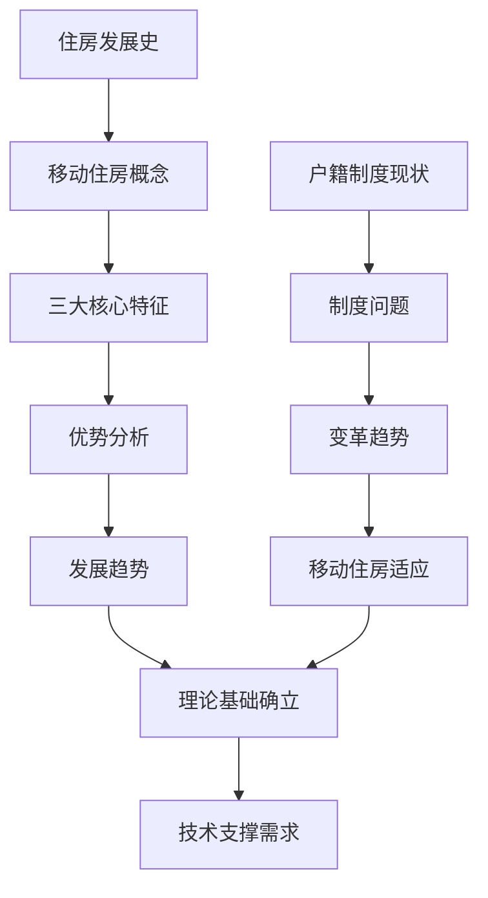

# 第一部分：理论基础

> "理论是实践的先导，基础是发展的根本。" —— 移动住房时代理论建构

## 📖 部分概述

第一部分从理论层面为移动住房时代奠定基础，通过历史回顾和制度分析，建立对移动住房的全面认知框架。本部分包含两个核心章节，分别从住房发展史和社会制度两个维度，论证移动住房的历史必然性和制度可行性。

---

## 🎯 核心目标

### 理论建构
- 📚 **历史定位**：将移动住房置于住房发展史的第四阶段
- 🏛️ **制度分析**：分析户籍制度变革对移动住房的支撑作用
- 🔬 **科学论证**：用数据和事实论证移动住房的合理性
- 🌍 **社会价值**：阐述移动住房的社会意义和发展前景

### 认知建立
- 💡 **概念澄清**：明确移动住房的定义和特征
- 🔄 **思维转变**：从固定住房到移动住房的思维转换
- ⚖️ **利弊分析**：客观分析移动住房的优势和挑战
- 🎯 **价值认同**：建立对移动住房价值的认同

---

## 📚 章节结构

### [第1章 住房发展史与移动住房概念](../chapter01.md)
**核心内容：**
- 🏠 住房发展的四个历史阶段
- 🔧 移动住房的三大核心特征（移动化、模块化、接口化）
- 💰 移动住房的经济、社会、技术优势
- 📈 移动住房的发展趋势和市场前景

**关键数据：**
- 成本节省：购置成本降低90%+，使用成本降低85%+
- 环保效益：碳排放减少70-80%，资源消耗减少90%+
- 市场前景：2030年预计市场规模2000亿元

### [第2章 户籍制度现状与变革趋势](../chapter02.md)
**核心内容：**
- 🏛️ 户籍制度的历史演变和现状问题
- 📚 教育资源分配不均与移动住房的解决方案
- 🏥 社会保障体系分割与制度创新需求
- 🔮 户籍制度变革趋势与移动住房的适应性

**关键数据：**
- 教育差异：985录取率地区差异达5倍以上
- 医疗差异：异地就医报销比例相差30%
- 房价影响：学区房溢价50-200%

---

## 🔗 逻辑关系

**逻辑脉络：**
1. **历史必然性**：从住房发展史看移动住房的必然出现
2. **技术可行性**：三大核心特征的技术实现
3. **经济合理性**：成本优势和投资回报分析
4. **制度适应性**：户籍制度变革为移动住房创造条件
5. **社会价值性**：解决社会问题，促进公平发展

---

## 📊 核心数据汇总

### 经济效益对比
| 指标 | 传统住房 | 移动住房 | 节省比例 |
|------|----------|----------|----------|
| 购置成本 | 200-500万 | 6-20万 | 90%+ |
| 年使用成本 | 18-28万 | 0.8-1.7万 | 85%+ |
| 搬迁成本 | 5-15万 | 0.05-0.1万 | 95%+ |
| 维护成本 | 0.5-1.5万/年 | 0.2-0.4万/年 | 70%+ |

### 社会问题解决
| 问题 | 传统方案 | 移动住房方案 | 改善程度 |
|------|----------|--------------|----------|
| 学区房问题 | 高价购买 | 跟随教育资源 | 根本解决 |
| 异地就医 | 报销困难 | 就近就医 | 显著改善 |
| 人口流动 | 户籍限制 | 自由流动 | 完全解决 |
| 住房负担 | 房贷压力 | 无贷款压力 | 根本缓解 |

### 环境效益
| 指标 | 传统住房 | 移动住房 | 改善比例 |
|------|----------|----------|----------|
| 碳排放 | 8-12吨CO₂/年 | 2-4吨CO₂/年 | 70-80% |
| 建筑材料 | 大量消耗 | 可循环利用 | 90%+ |
| 土地占用 | 永久占用 | 临时使用 | 95%+ |
| 建筑垃圾 | 大量产生 | 几乎为零 | 99%+ |

---

## 🎯 学习建议

### 阅读顺序
1. **第1章**：建立移动住房的基本概念和认知
2. **第2章**：理解制度环境和政策支持

### 重点关注
- 🔍 **概念理解**：移动住房的三大核心特征
- 📊 **数据分析**：成本效益和社会效益数据
- 🏛️ **制度分析**：户籍制度变革趋势
- 🔮 **前景展望**：发展趋势和市场前景

### 思考问题
1. 移动住房相比传统住房的根本优势是什么？
2. 户籍制度改革如何为移动住房创造条件？
3. 移动住房如何解决当前的社会问题？
4. 移动住房的发展前景如何？

---

## 🔗 相关资源

### 延伸阅读
- [住房发展史研究](../../assets/data/housing-history.md)
- [户籍制度改革文件](../../assets/data/policy-documents.md)
- [移动住房案例集](../../assets/data/case-studies.md)

### 数据来源
- 国家统计局住房数据
- 教育部高考录取数据
- 各地户籍制度改革政策
- 国际移动住房发展报告

### 下一步学习
完成第一部分学习后，建议继续学习：
- [第二部分：技术支撑](../part2/) - 了解支撑移动住房的关键技术
- [第三部分：实践应用](../part3/) - 学习具体的设计和应用方案

---

*第一部分概述完*  
*总字数：约1.5万字*  
*建议学习时间：1-2小时* 